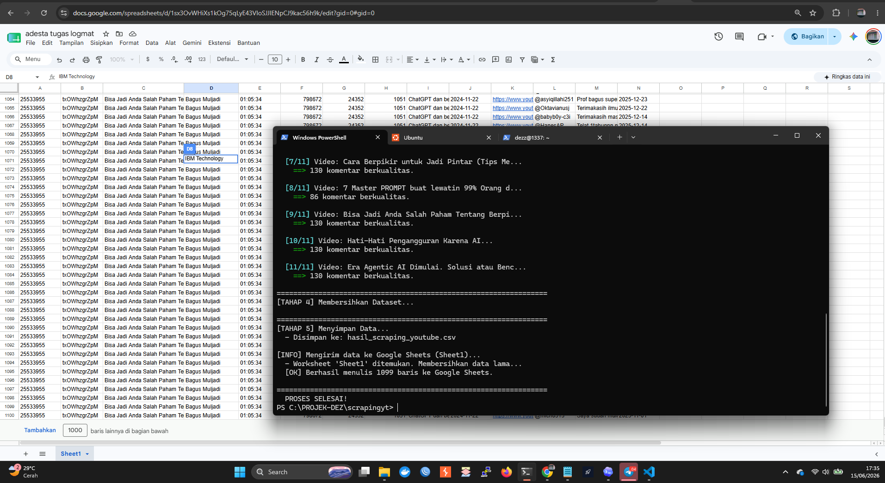

# 🎥 YouTube AI Comments Scraper + Google Sheets Integration


Program otomasi berbasis Python untuk mengumpulkan dataset komentar dari YouTube secara cerdas. Dilengkapi dengan filter kualitas, dukungan pencarian berbasis kata kunci, dan integrasi otomatis langsung ke **Google Sheets**.



---

## ✨ Fitur Unggulan

- 🚀 **Otomasi Penuh**: Cari video, ambil statistik (View, Like, Durasi), dan tarik komentar dalam satu perintah.
- 📊 **Integrasi Google Sheets**: Hasil scraping langsung terkirim ke Google Sheets dengan format yang rapi.
- 🧹 **Pembersihan Data Otomatis**: Menghapus duplikat dan karakter sampah (line breaks) agar data siap diolah.
- 🎨 **Modern Terminal UI**: Tampilan output terminal yang berwarna (Colorama) dan informatif.
- 🔑 **Keamanan API**: Mendukung penggunaan file `.env` dan `service_account.json` untuk menjaga kerahasiaan kunci akses.
- 🛠️ **Customizable**: Tentukan sendiri jumlah video, target komentar, dan kata kunci melalui file eksternal.

---

## 📋 Struktur Kolom Dataset

Hasil akhir akan disimpan dalam satu tabel (Sheet) dengan urutan kolom sebagai berikut:

| Kolom | Deskripsi |
|-------|-----------|
| `NIM` | Nomor Induk Mahasiswa pengumpul data |
| `Video_ID` | ID unik video YouTube |
| `Judul_Video` | Judul video |
| `Channel` | Nama channel YouTube |
| `Durasi` | Durasi video (format HH:MM:SS) |
| `Jumlah View` | Total view video |
| `Jumlah Like` | Total like video |
| `Jumlah Komentar` | Total komentar di video |
| `Topik` | Kata kunci pencarian yang menemukan video |
| `Tanggal_Video` | Tanggal video di-upload (YYYY-MM-DD) |
| `URL_Video` | Link video YouTube |
| `Nama_Komentator` | Nama akun yang berkomentar |
| `Teks_Komentar` | Isi komentar |
| `Tanggal_Komentar` | Tanggal komentar ditulis (YYYY-MM-DD) |

---

## 🛠️ Panduan Setup Lengkap (Step-by-Step)

### Langkah 1: Instal Python & Library

Pastikan Python 3.8+ sudah terinstal di komputer Anda. Kemudian jalankan:

```bash
pip install requests pandas python-dotenv gspread google-auth colorama
```

### Langkah 2: Buat Project di Google Cloud Console

1. Buka [Google Cloud Console](https://console.cloud.google.com/).
2. Login dengan akun Google Anda.
3. Klik **dropdown nama project** di pojok kiri atas (di sebelah logo Google Cloud).
4. Klik **"NEW PROJECT"**.
5. Beri nama project (misal: `youtube-scraper`), lalu klik **"CREATE"**.
6. Pastikan Anda sudah **berpindah ke project baru tersebut** (klik dropdown lagi -> pilih project baru).

### Langkah 3: Aktifkan 3 API yang Dibutuhkan

Di dalam project baru Anda, Anda harus mengaktifkan **3 API** berikut:

1. Klik menu **☰ (hamburger)** di kiri atas -> **"APIs & Services"** -> **"Library"**.
2. Cari dan aktifkan (**ENABLE**) satu per satu:

| API | Fungsi |
|-----|--------|
| **YouTube Data API v3** | Untuk mencari video dan mengambil komentar dari YouTube |
| **Google Sheets API** | Untuk menulis data ke Google Sheets |
| **Google Drive API** | Untuk mengakses/membuka file Spreadsheet Anda |

> ⚠️ **PENTING**: Jika salah satu API tidak diaktifkan, program akan error meskipun API Key sudah benar.

### Langkah 4: Buat YouTube API Key

1. Klik menu **☰** -> **"APIs & Services"** -> **"Credentials"**.
2. Klik tombol **"+ CREATE CREDENTIALS"** di atas -> pilih **"API key"**.
3. Sebuah API Key akan muncul (format: `AIzaSy...`). **Salin (copy) API Key tersebut**.
4. (Opsional tapi disarankan) Klik **"Restrict Key"** -> pilih **"YouTube Data API v3"** agar key hanya bisa dipakai untuk YouTube.

### Langkah 5: Buat Service Account (untuk Google Sheets)

1. Masih di halaman **"Credentials"**.
2. Klik **"+ CREATE CREDENTIALS"** -> pilih **"Service Account"**.
3. Isi **Service Account Name** (misal: `bot-sheets`), lalu klik **"CREATE AND CONTINUE"**.
4. Di langkah **"Grant this service account access to project"**:
   - Pilih role: **"Editor"** (atau "Basic" -> "Editor").
   - Klik **"CONTINUE"**.
5. Di langkah **"Grant users access"**: Langsung klik **"DONE"** (lewati).
6. Klik **email Service Account** yang baru dibuat (ada di daftar).
7. Pergi ke tab **"KEYS"** di atas.
8. Klik **"ADD KEY"** -> **"Create new key"**.
9. Pilih **"JSON"** -> klik **"CREATE"**.
10. File `.json` akan otomatis ter-download ke komputer Anda.
11. **Rename file tersebut menjadi `service_account.json`** dan taruh di folder project Anda.

### Langkah 6: Hubungkan Service Account ke Google Sheets

1. Buka file `service_account.json` yang sudah di-download.
2. Cari baris `"client_email": "..."` (contoh: `bot-sheets@youtube-scraper.iam.gserviceaccount.com`).
3. **Salin email tersebut**.
4. Buka Google Sheets yang ingin Anda gunakan sebagai tujuan data.
5. Klik tombol **"Share" (Bagikan)** di pojok kanan atas.
6. Tempelkan email Service Account tadi.
7. Pastikan role-nya **"Editor"**.
8. Klik **"Send"** (Kirim).

> ⚠️ **PENTING**: Jika email Service Account belum di-share ke Spreadsheet, program akan berhasil berjalan tapi data TIDAK akan masuk ke Google Sheets.

### Langkah 7: Konfigurasi File Project

1. **Clone repository** dan masuk ke folder:
   ```bash
   git clone https://github.com/dzDev3/youtube-ai-scraper.git
   cd youtube-ai-scraper
   ```

2. **Buat file `.env`** (salin dari template):
   ```bash
   copy .env.example .env
   ```
   Kemudian edit file `.env` dan isi API Key Anda:
   ```
   YOUTUBE_API_KEY=AIzaSyxxxxxxxxxxxxxxxxxxxxxxxxxxxxxxxx
   ```

3. **Edit `keywords.txt`**: Tambahkan kata kunci pencarian video (satu per baris).
   ```
   AI dalam pendidikan
   ChatGPT untuk belajar
   dampak AI pada siswa
   ```

4. **Edit `nim.txt`**: Isi NIM Anda.
   ```
   25533955
   ```

5. **Taruh `service_account.json`** di folder utama project (sejajar dengan `main.py`).

---

## 🚀 Cara Menjalankan Program

Setelah semua konfigurasi selesai, jalankan:

```bash
python main.py
```

Program akan menanyakan:
1. **URL Google Sheets** (hanya saat pertama kali dijalankan, selanjutnya tersimpan otomatis).
2. **Jumlah video** yang ingin diambil datanya.
3. **Target komentar per video** (misal: 100 komentar per video).

Kemudian program akan:
1. Mencari video YouTube berdasarkan kata kunci di `keywords.txt`.
2. Menyaring video yang memiliki minimal 100 komentar.
3. Mengambil komentar dari setiap video sebanyak target yang ditentukan.
4. Membersihkan data (hapus duplikat, karakter sampah).
5. Menyimpan ke file CSV lokal dan mengirim ke Google Sheets secara otomatis.

---

## 📂 Struktur File

```
youtube-ai-scraper/
├── main.py                  # Skrip utama program
├── keywords.txt             # Daftar kata kunci pencarian
├── nim.txt                  # NIM pengumpul data
├── spreadsheet_url.txt      # URL Google Sheets (auto-generated)
├── service_account.json     # Kredensial Google (JANGAN di-push!)
├── .env                     # API Key YouTube (JANGAN di-push!)
├── .env.example             # Template .env
├── .gitignore               # File yang diabaikan oleh Git
├── img/                     # Folder screenshot
│   └── example.png          # Screenshot contoh
└── README.md                # Dokumentasi ini
```

---

## ❓ Troubleshooting (Masalah Umum)

| Masalah | Penyebab | Solusi |
|---------|----------|--------|
| `429 Too Many Requests` | Kuota API harian habis | Tunggu reset (besok) atau buat Project baru di Google Cloud |
| `[WARNING] service_account.json tidak ditemukan` | File kredensial belum ada | Ikuti Langkah 5 di atas |
| Data tidak muncul di Google Sheets | Service Account belum di-share | Ikuti Langkah 6 di atas |
| `API key YouTube tidak ditemukan` | File `.env` belum dibuat | Ikuti Langkah 7 di atas |
| `ModuleNotFoundError` | Library belum diinstal | Jalankan `pip install requests pandas python-dotenv gspread google-auth colorama` |

---

## 🛡️ Disclaimer

Program ini dibuat untuk tujuan edukasi dan riset data. Pastikan untuk selalu mematuhi *Terms of Service* dari YouTube Data API dalam mengumpulkan data. Kuota YouTube Data API v3 dibatasi sekitar **10.000 unit per hari** per project.

---

**Developed with by [Dzdev3](https://github.com/dzDev3)**
